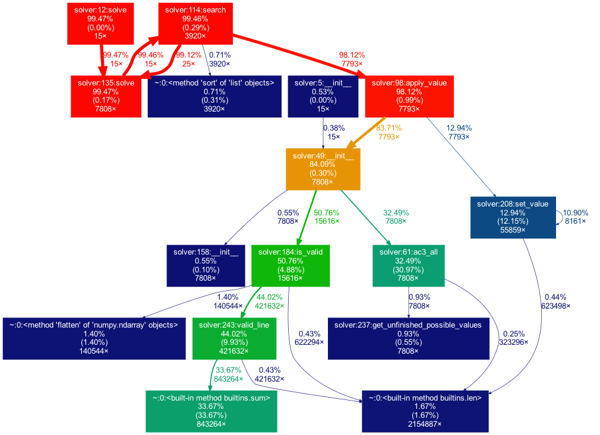

# Sudoku Solver using Contraint Propagation and Backtracking

## Installing

Run `pipenv install` to install the dependencies, then `pipenv shell` to activate it

## Testing

> Take a look at the [data folder](./data) for instructions on downloading test data.

First follow the instructions in the installation section above, then from within the shell run the following:

```
python -m unittest discover -s . -p 'solver_test.py'
```

The tests can also be run from VS Code.

## Method

This Sudoku solver uses Constraint Propagation using the Arc Consistency Algorithm #3 (AC-3) [1], and then depth-first search (DFS) with Backtracking using the Minimum Remaining Value (MRV) heuristic and Forward Checking (FC).

The implementation details for these algorithms are detailed in the sections below.

### Constraint Propagation

A sudoku puzzle is given by some initial values, and each cell must satisfy a known set of contraints. Because of this, it's very fitting to start solving them using a Contraint Satisfaction algorithm such as AC-3.

Before starting to solve the puzzle the code builds a dictionary mapping each cell in a sudoku to a list of cells that are "related" (the ones it shares the row, column, and square with) so that quick lookups can be performed while solving.

In my case I decided to use the AC-3 algorithm, adapting the implementation to this use-case for efficiency.

The algorithm creates a dictionary of cells to possible values (see Example 1 below), where all cells that don't have a value are initialised to the set of all candidates (`{1,2,3,4,5,6,7,8,9}`). Only cells that don't already have a value will be added to this dictionary - so the number of elements in it is the number of incomplete cells in the puzzle.

```
{
  (0,1): {1,2,3}
}
```

> Example 1: Dictionary of possible values, where the cell at coordinates (0,1) can have the values {1,2,3}

Once this dictionary is initialized, the algorithm adds all cells with possible values to a queue. For each cell, it iterates over its related cells, and when one has a final value set it removes it from the possible values for this cell.

If there's only one possible value left, it is set as the final value for this cell, and it removes it's entry from the possible values dictionary. Since this cell now has a value, it will affect it's related cells - so the ones that still have possible values are added to the queue.

When a sudoku is invalid, some cells may end up with no possible values left - in this case the algorithm terminates.

When this queue is empty, some cells will be filled in with final values, and the possible values will have been narrowed down. In some cases all cells will have final values, in which case the sudoku is solved.

For the constraints I decided to only use the three fundamental constraints of a Sudoku (no duplicates in the same row, column, or 3x3 square). I took this decision after profiling the execution time of more complex checks (such as naked twins, scanning in one/two directions, single candidates [2]... ), founding that the execution time got worse as they require too many traversals.

### Search with Backtracking

Not all sudokus will be solved with constraint propagation alone (at least not without implementing severl additional constraints, as mentioned above), so a search algorithm was implemented to solve the more complex puzzles.

It's a simple backtracking algorithm, traversing the options depth-first, and starting with the cells with the least amount of possible values (MRV [3]) and then using Forward Checking [3] to detect invalid states earlier.

By starting with the cells that have the minimum number of possible values we maximise the chances of solving it on fewer iterations (i.e. if the initial cell has only two values there's a 50% chance that the first value will be the correct one)

The search algorithm thus builds a queue with the unfinished cells sorted by least possible values, and recursively searches the tree by setting the first possible value for this cell and attempting to solve given this condition (starting from the AC-3 step again). If the state is valid but not finished it starts the search algorithm with another unfinished cell. In order to optimise the algorithm, the possible values are passed down when backtracking, and invalid states are checked before running the AC-3 algorithm again (for the Forward Checking step).

When it hits an invalid state it "backtracks" out of this branch, going back to the previous level, and selecting a different value for that cell. If all values are exhausted for that cell then it backtracks up again, and so on.

After a few iterations it will either land on a solution to the puzzle, or it will know that it's unsolvable.

## Results

The algorithm solves all provided sudokus plus additional hard ones found online for additional validation. Sudokus that can be solved with constraint propagation alone take on average 0.003s on my machine, and hard valid ones range from 0.03-0.1s, with hard invalid ones reaching up to 0.3s.

In order to reach these numbers I profiled the code using cProfiler [4] and inspected the results with gprof2dot [5] and SnakeViz [6]. See Figure 1 below for the graph generated while solving all 15 hard sudokus.



> Figure 1: Execution profile graph generated by gprof2dot

After some time profiling and improving my code I realised that I was mainly limited by the underlaying data structures, as most of the execution time was spent getting the value for a certain cell (23%) and checking the validity of the sudoku (25%) as these were called extremely often.

For further performance improvements I would use a dictionary to store the sudoku, keyed by cell coordinates. And apparently a string of digits to store the possible values for each cell yields better performance than the sets I used [7].

I decided to leave my implementation as is because these performance optimisations no longer meant a better algorithm, and instead relied on faster ways to store and access the underlaying data, at the expense of code quality and readability.

## Conclusion

While a brute-force approach is practically impossible on a sudoku, a smarter search algorithm using backtracking and the techniques outlined above can solve even the most complex sudokus trivially.

This requires however manually writing the constraints. These can be as simple as the game rules, but as mentioned above can be fairly complex rules that humans have discovered when solving these puzzles.

It begs the question of whether a program could detect these complex contraints, and potentially discover unknown ones - and whether such a program would be able to solve a sudoku faster than a carefully coded search algorithm.

And would the same be true if the sudoku was bigger? Perhaps we can find a grid size where such a program would outperform the algorithms described in this paper.

## References

[1] Stuart Russel and Peter Norvig (2003). 'Artificial Intelligence: A Modern Approach', 202-233.

[2] Rohit Iyer et al. (2013). 'A Review of Sudoku Solving using Patterns', International Journal of Scientific and Research Publications. Vidyalankar Institute of Technology. Accessed 18 January 2021 <http://www.ijsrp.org/research-paper-0513/ijsrp-p1735.pdf>

[3] Max Welling (2009), 'Constraint Satisfaction Problems'. University of Amsterdam, accessed 18 January 2021 <https://www.ics.uci.edu/~welling/teaching/271fall09/CSP271fall09.pdf>

[4] The Python Profilers, Python Documentation. accessed 18 January 2021 <https://docs.python.org/3/library/profile.html>

[5] gprof2dot, accessed 18 January 2021 <https://github.com/jrfonseca/gprof2dot>

[6] SnakeViz, accessed 18 January 2021 <https://github.com/jiffyclub/snakeviz/>

[7] Peter Norvig. 'Solving Every Sudoku Puzzle', accessed 18 January 2021 <https://norvig.com/sudoku.html>
